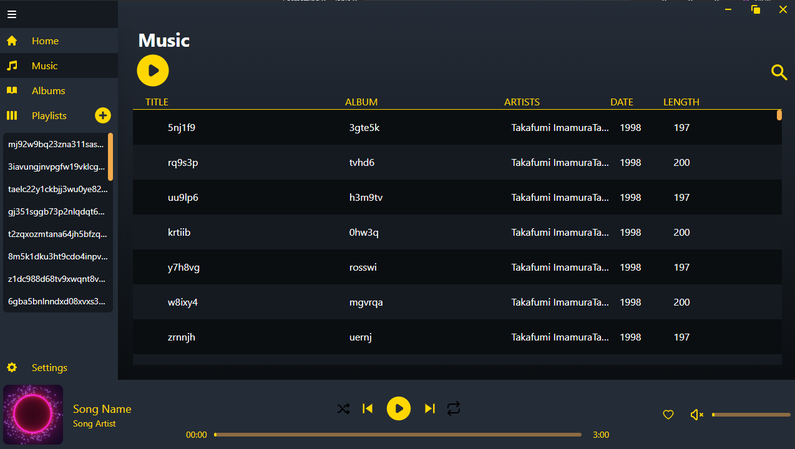
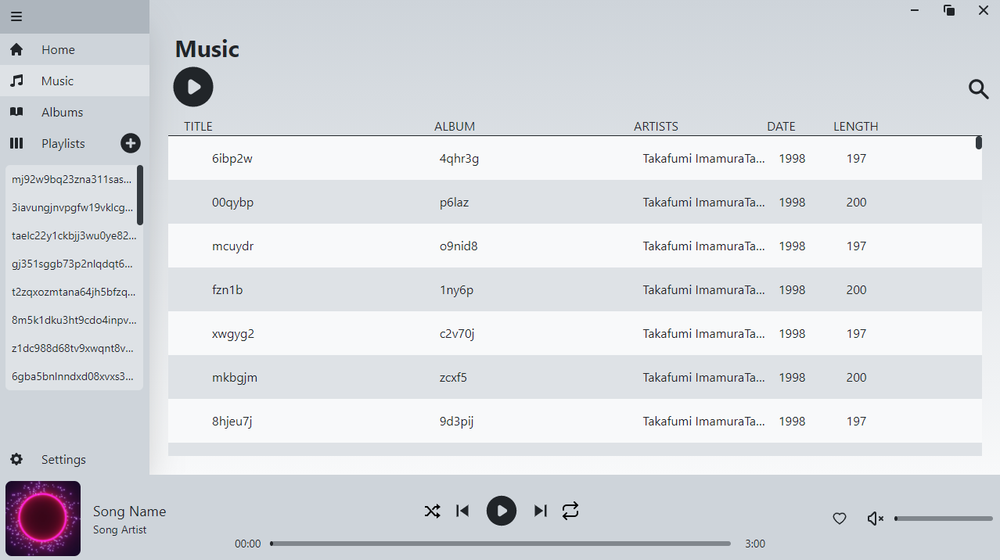

# vremotebrowser

Native music player

## Tech Stack

### Frontend

* React
* TailwindCSS
* HowlerJS

### Backend

* Electron
* LowDB
* Nedb

## Getting Started

1. `yarn install`
2. `yarn start`

## Notes

1. Please run `yarn lint` before commit.

## Applicatiion Demo

## Features
1. Plays all HTML Audio formats
2. Searchs path for music and creates albums
3. Allows users to create/edit playlists
4. Allows users to favorite music
5. Search functionality for songs, playlists, albums

### Screenshots

